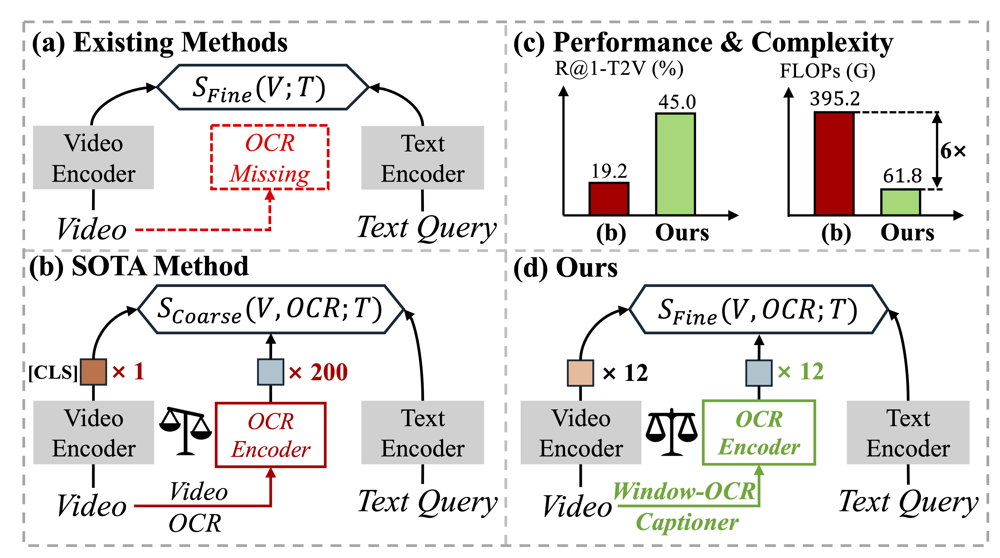
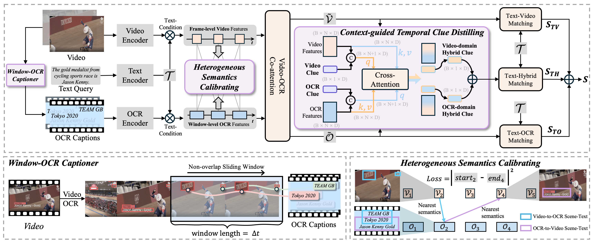
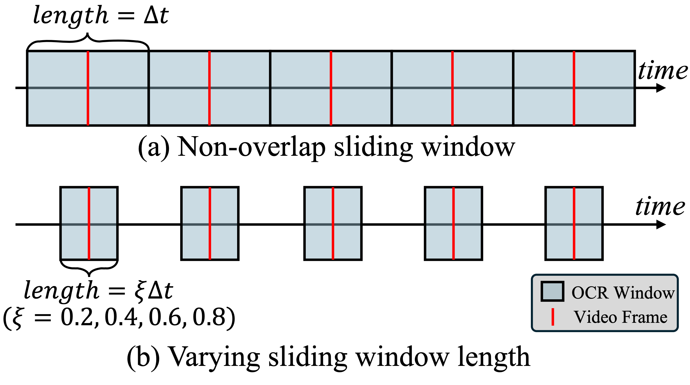
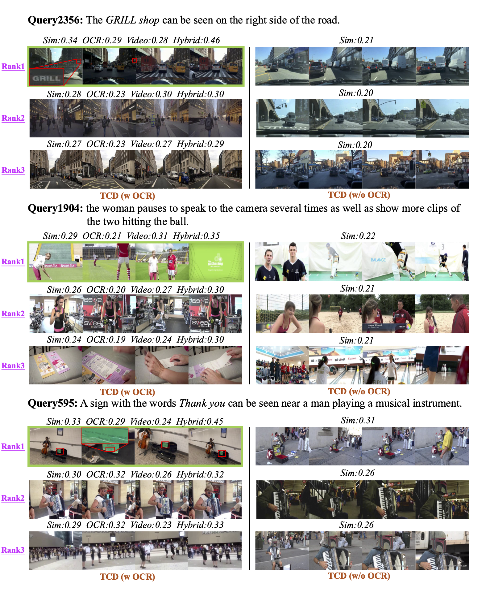
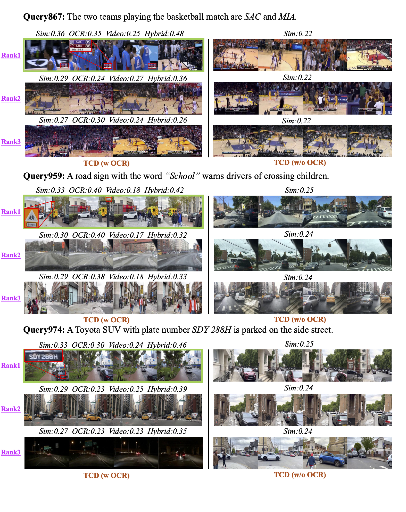
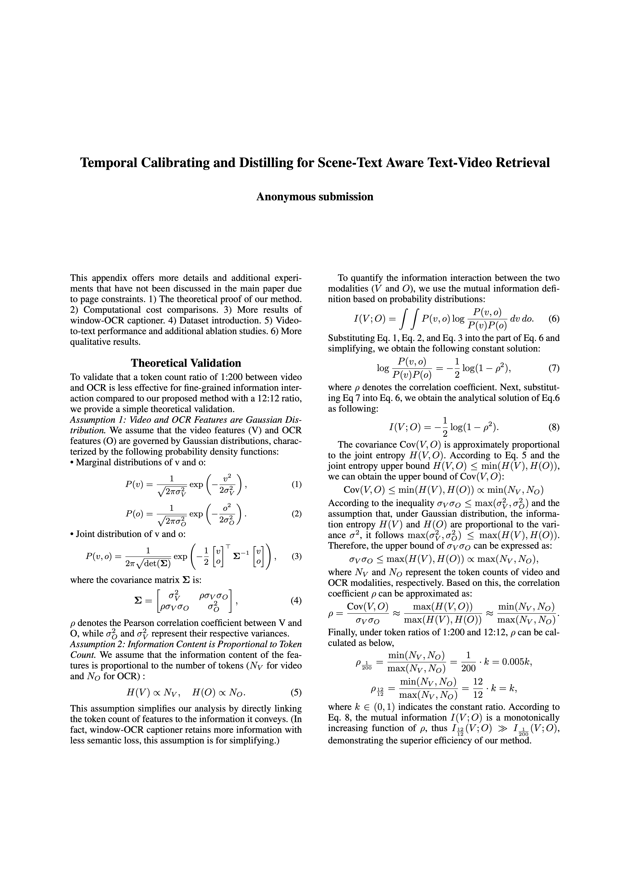
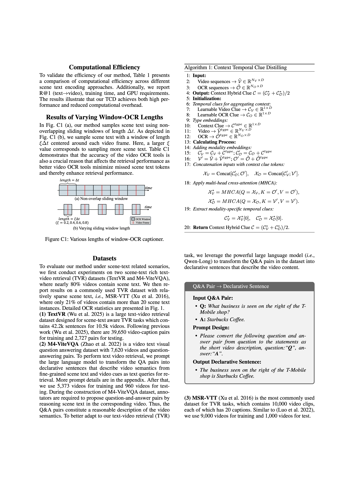
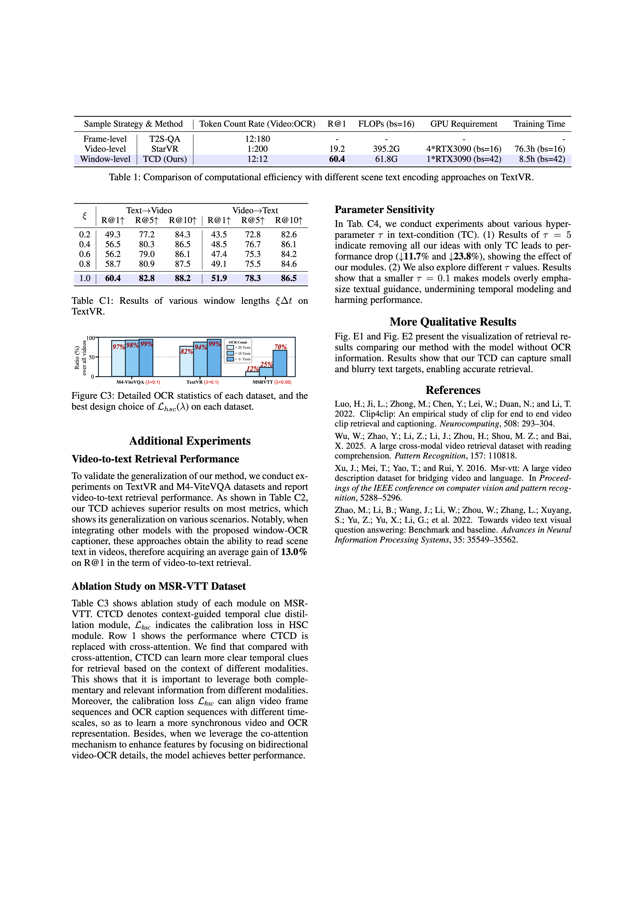
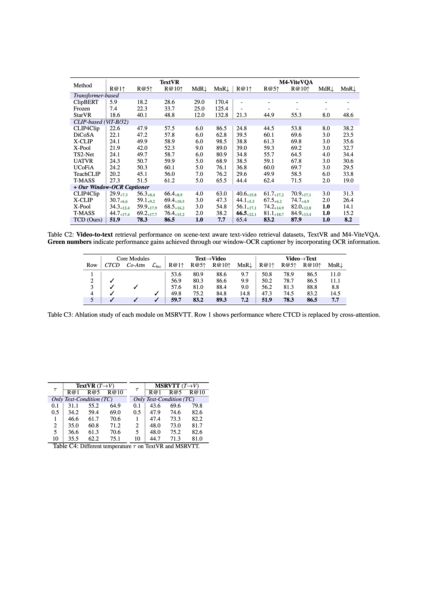

# Temporal Calibrating and Distilling for Scene-Text Aware Text-Video Retrieval

## [1/9] Task Introduction

    <figure>
        
    </figure>

<b>Figure 1:</b> (a) Existing methods overlook fine-grained scene text in videos. (b) SOTA method treats scene text as isolated instances, resulting in token imbalance issue that limits fine-grained interactions. (d) Our window-OCR captioner condenses scene text into OCR captions, achieving better performance with lower complexity (c).

### Examples in the TextVR Dataset

  

    
Query Text: The gold medalist from the cycling sports branch is Jason Kenny.

    

      <video controls width="330" height="170">
        <source src="video/5jKLoEt7RBg_00000_00010.mp4" type="video/mp4">
      </video>
      Target Video
    

  

  

    
Query Text: The store TESCO express offers fresh vegetables.

    

      <video controls width="330" height="170">
        <source src="video/i-DkWPfL4N4_00090_00105.mp4" type="video/mp4">
      </video>
      Target Video
    

  

## [2/9] Model Architecture

<b>Figure 2:</b> 
Pipeline of <b>TCD</b>. Window-OCR captioner condenses abundant scene text into OCR captions. Heterogeneous semantics calibrating leverages scene text present in both video and OCR captions as a self-supervised signal for temporal alignment. Context-guided temporal clue distilling assigns each modality a learnable clue token to extract clear temporal clues.

<!-- 

    <figure>
        <video controls style="width: 100%;">
            <source src="video.mp4" type="video/mp4">
            Your browser does not support the video tag.
        </video>
    </figure>

 -->

## [3/9] Window-OCR Captioner 🌟🌟🌟

    <figure>
        
    </figure>

<b>Figure 3:</b> Visualization of the proposed Window-OCR Captioner. We aggregrate different kinds of scene texts appearing within a window length of ∆t into a single caption to reduce the feature length from N in previous works (e.g., StarVR [53]) to 1.

## [4/9] Visualization of Our Window-level Sampling Strategy

    <figure>
        
    </figure>

<b>Figure 4:</b> Our window-level sampling strategy samples scene text using non-overlapping sliding windows. We sample scene text with a window centered around each video frame. Here, a larger window length value corresponds to sampling more scene text. 

## [5/9] Heterogeneous Semantics Calibrating

    <figure>
        
    </figure>

<b>Figure 5:</b> Demo of the proposed Heterogeneous Semantics Calibrating. We leverage heterogeneous scene text as the calibration signal to align sequences with different time-scales. The nearest semantic match follows the highest similarity score between the element in the first sequence and each element in the second sequence.

<!-- 

    <figure>
        <video controls style="width: 100%;">
            <source src="video2.mp4" type="video/mp4">
            Your browser does not support the video tag.
        </video>
    </figure>

 -->

## [6/9] Text→Video Retrieval Results (1/2)

<b>Figure 6:</b> Visualization of retrieval results comparing our method (left) with the model without OCR information (right). Sim indicates the overall similarity
score, calculated as the average of text-OCR, text-video, and text-hybrid matching scores, denoted as OCR, Video, and Hybrid, respectively. Our TCD captures fine-grained scene text, such as "GRILL" and "Thank you" with high similarity and hybrid scores. Please zoom in for a better view of the details.

## [7/9] Text→Video Retrieval Results (2/2)

<b>Figure 7:</b> Visualization of retrieval results comparing our method (left) with the model without OCR information (right). Sim represents the overall similarity
score, calculated as the average of text-OCR, text-video, and text-hybrid matching scores, denoted as OCR, Video, and Hybrid, respectively. Our TCD captures fine-grained scene text, such as "SAC MIA", "School", and "SDY 288H" with high similarity and hybrid scores. Please zoom in for a better view of the details.

## [8/9] Appendix

## [9/9] Abstract

Existing text-video retrieval methods mainly focus on single-modal video content (i.e., visual entities), often overlooking heterogeneous scene text that is ubiquitous in human environments. Although scene text in videos provides fine-grained semantics for cross-modal retrieval, effectively utilizing it presents two unique challenges: (1) Temporally dense scene text disrupts sync with sparse video frames, obstructing video understanding; (2) Redundant scene text and irrelevant video frames hinder the learning of discriminative temporal clues for retrieval. In this paper, we address these challenges by proposing a temporal scene-text calibrating and distilling (TCD) network for text-video retrieval. Specifically, we first design a window-OCR captioner that aggregates dense scene text into OCR captions to facilitate feature interaction. Next, we devise a heterogeneous semantics calibration module that leverages scene text as a self-supervised signal to temporally align window-level OCR captions and frame-level video features. Further, we introduce a context-guided temporal clue distillation module to learn the complementary and relevant details between scene text and video modalities, thereby obtaining discriminative temporal clues for retrieval. Extensive experiments show that the proposed TCD achieves state-of-the-art performance on three scene-text related benchmarks.

**The source code and trained models will be released soon.**
